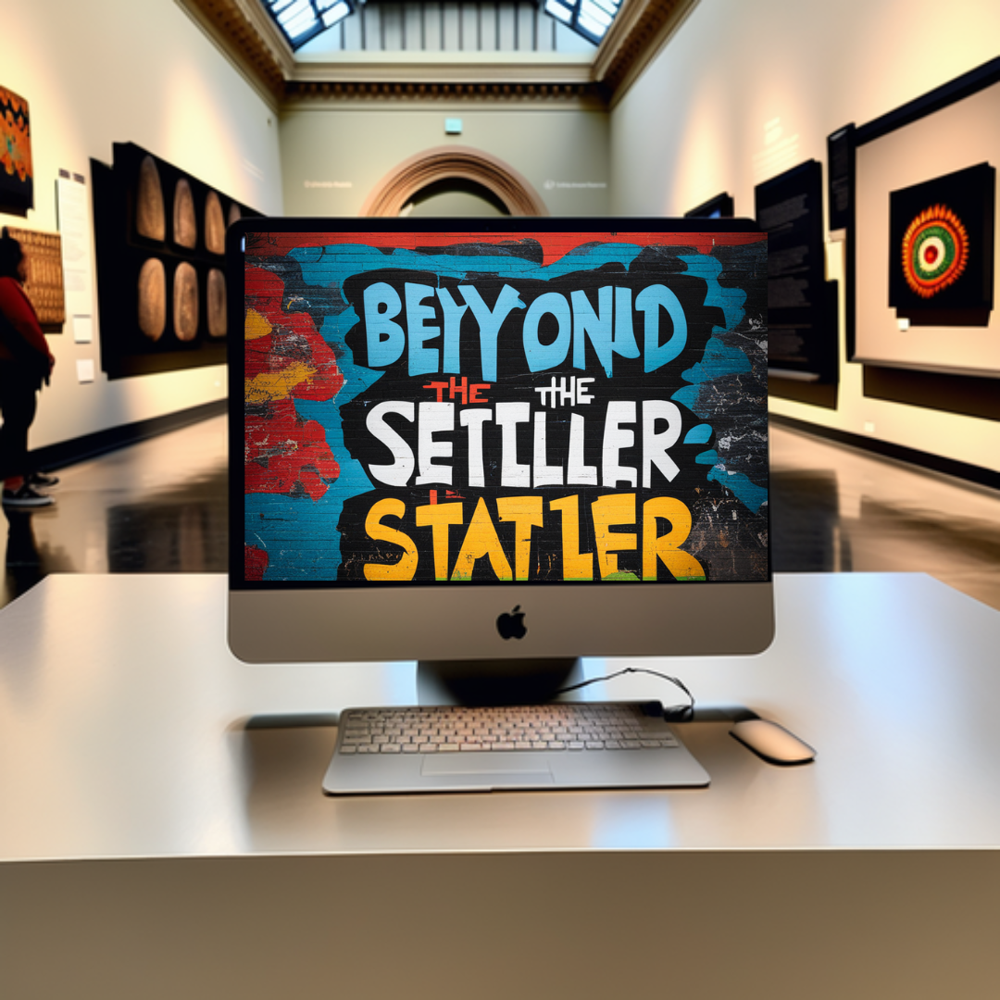
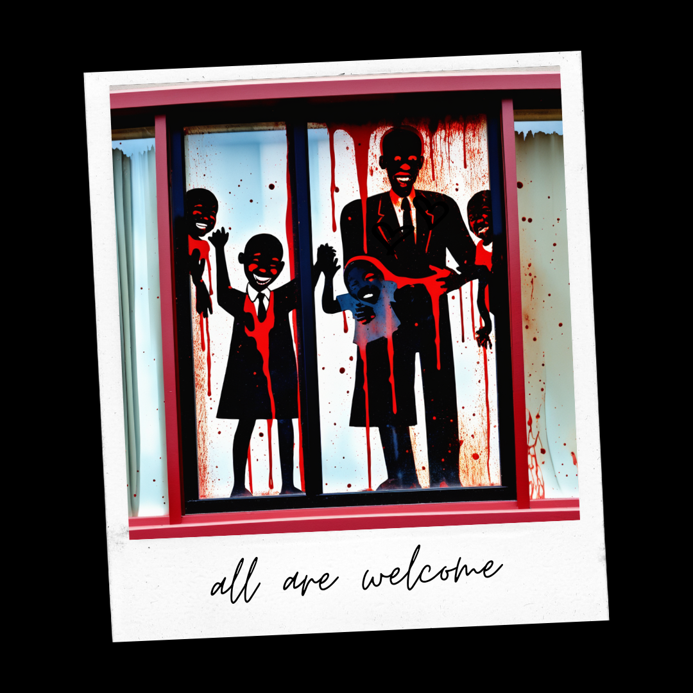
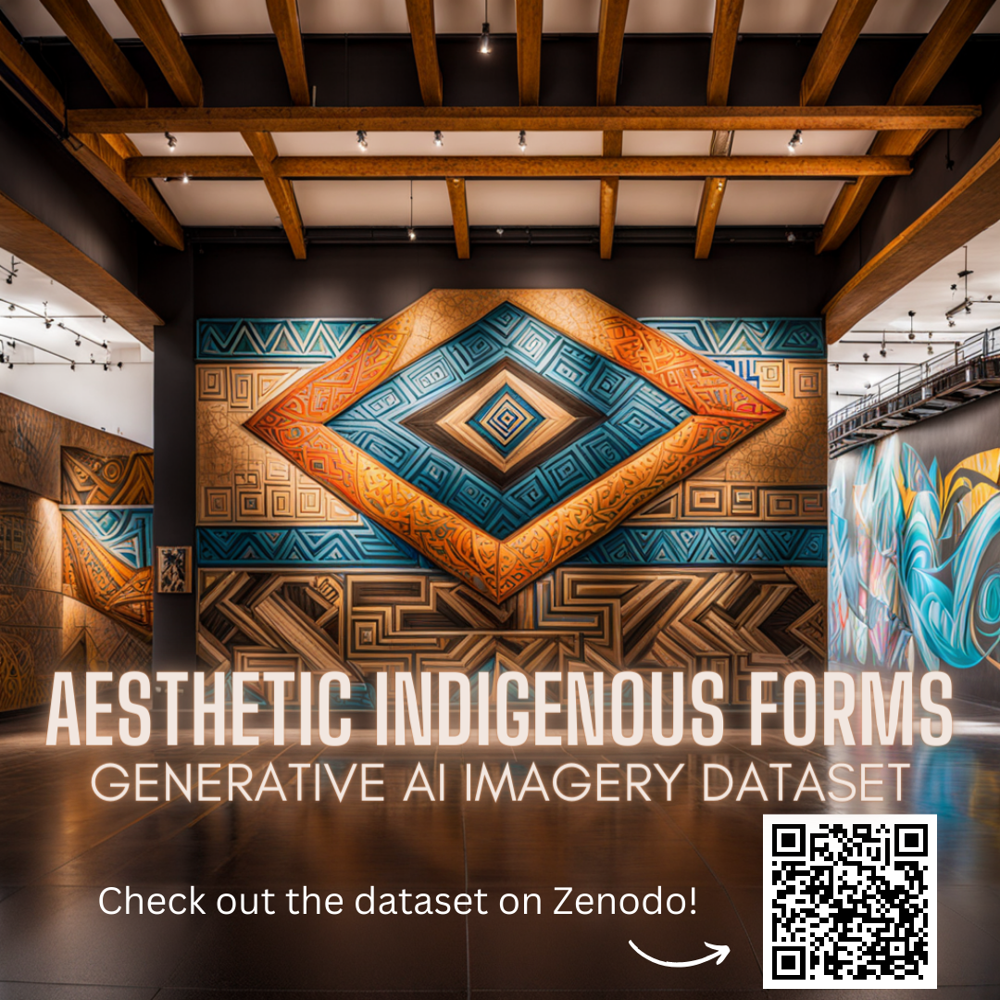

# About the Post Colonial Museum Project

AI ART: “A Curatorial Dream: Beyond the Settler State.” © 2023 by Dana Reijerkerk is licensed under CC BY-NC-ND 4.0. 
&nbsp;  

The Post Colonial Dreams Museum is a digital museum that explores community in the contexts of climate racism, Indigeneity, and climate change through Philadelphia’s Black public art, generative AI images, and environmental histories. The virtual museum is organized into seven temporal realities - seven chapters to align with the idea of seven cardinal directions (east, west, north, south, up, down, you at the center). Each chapter is a retelling of the lived aftermath and speculative future imaginations of the Black and Indigenous experience beyond the settler colonial state in Philadelphia, PA. 

## All Are Welcome Video Game

AI ART: All Are Welcome © 2023 by Dana Reijerkerk is licensed under CC BY-NC-ND 4.0. 

All Are Welcome is a nonlinear psychological horror text-based game that explores the horror of the Black and Indigenous experience in the United States while touring a virtual reality art exhibition. Play as a Black climate refuge visiting the museum where visitors become the art. Available for free on itch.io: (https://decolfutures.itch.io/all-are-welcome) 

### Features
- Experience seven unique deaths across eight chapters that piece together the full Afrofuturist story.
- Reluctantly face off against AI generated artworks based on real-life public art in Philadelphia, PA.
- Make split-second choices that extend your life or take it.

## Aesthetic Indigenous Forms Dataset

AI ART: Aesthetic Indigenous Forms Generative AI Imagery Dataset © 2023 by Dana Reijerkerk is licensed under CC BY-NC-ND 4.0. 
&nbsp;  

The past, present, and future of our city communities in the United States exist within colonization's ongoing violence - a perpetual state of lived aftermath to stolen lands, white supremacy, genocide, slavery, and anthropogenic climate change. Our land and water relations remember how we treat them with sewage, chemicals, and trash, and they influence the artistic expressions and world's of Black Philadelphia writers, philosophers, artists. The Aesthetic Indigenous Forms Dataset includes 29 generative artificial intelligence (Gen AI) images, historical research, and curatorial prose that complicates the stories of climate racism, Indigeneity, and climate change that Philadelphia's public art and environmental histories tell. This data is integrated within the Post Colonial Dreams Museum, one of two distinct, yet interconnected virtual museums in [_Relational Possibilities: A Remix of Aesthetic Forms Through Indigeneity and Blackness_](https://tinyurl.com/thecreativecollabproject).

Curated by Dana Reijerkerk, B.A., M.I.S.
The Creative CoLab Project: Relational Possibilities, LEADING Fellow 2023-2024. 
This work is licensed under: [CC BY-NC-ND 4.0](https://creativecommons.org/licenses/by-nc-nd/4.0/). 

This data is available for free to view and download at: (https://zenodo.org/doi/10.5281/zenodo.10262605) 

## Methods and Approach
I used generative AI, video game design, curatorial vignettes, research, and data visualizations to create this project. 

### Sources 
This is an artistic data science project grounded in local contexts (Philadelphia, Pennsylvania).

AI ART: "Listen to the water." © 2023 by Dana Reijerkerk is licensed under CC BY-NC-ND 4.0.
&nbsp;  

I collected my sources, thoughts, and inspiration in a Zotero library as I curated this exhibition. As a decolonial scholar, I prioritize using non-traditional sources (e.g. social media, newspaper articles). From an Indigenous Studies perspective, community data is held within social media and Internet-based sources. This is important because traditional ideas in academia about scholarship limit what is authoritative and "scholarly" to print sources (books, journal articles, research studies).

### Data Science Tools
I used free, open source tools to assemble my art exhibition. My "Relational Possibilities" co-curator and I felt it was important that this project could be replicated at scale. I utilized these tools:
- Generative AI: ChatGPT, Playground.ai, Craiyon.ai
- Video Game Design: Twine, Canva, freesounds.org, Google Docs
- Publication Tools: Scalar, GitHub, Jupyter Notebooks, itch.io, Zenodo
- Digital museum design: AI, HTML, CSS, JavaScript, Canva

## Introduction to The Creative CoLab LEAD Project
> our relations remember how we treat them
> 
> we waste away
> 
> justice is a conscious choice
> 
> Cause, I am, still Black see
> 
> Cause, I am, still Indigenous see
> 
> relational possibilities

As the seminal collaboration between The Creative CoLab, “Relational Possibilities” is a digital community archive data science project that explores community relations and futurist realities of Indigeneity and Blackness through artists, writers, and public art in Philadelphia. “Relational Possibilities” pulls together original datasets, generative artificial intelligence imagery, itch.io video games, a podcast, vignettes, and curatorial statements into two distinct, interconnected virtual museums. Through a lens of community, visitors experience the shared history of African Americans in Philadelphia through 7 Black visual and literary artists and the stories of climate racism, Indigeneity, and climate change that public art and environmental histories tell. 

To learn more, visit our project at (https://tinyurl.com/thecreativecollabproject) 
